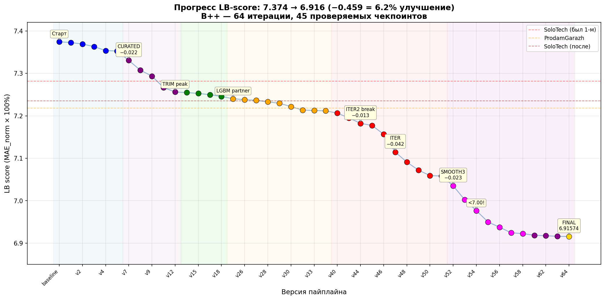
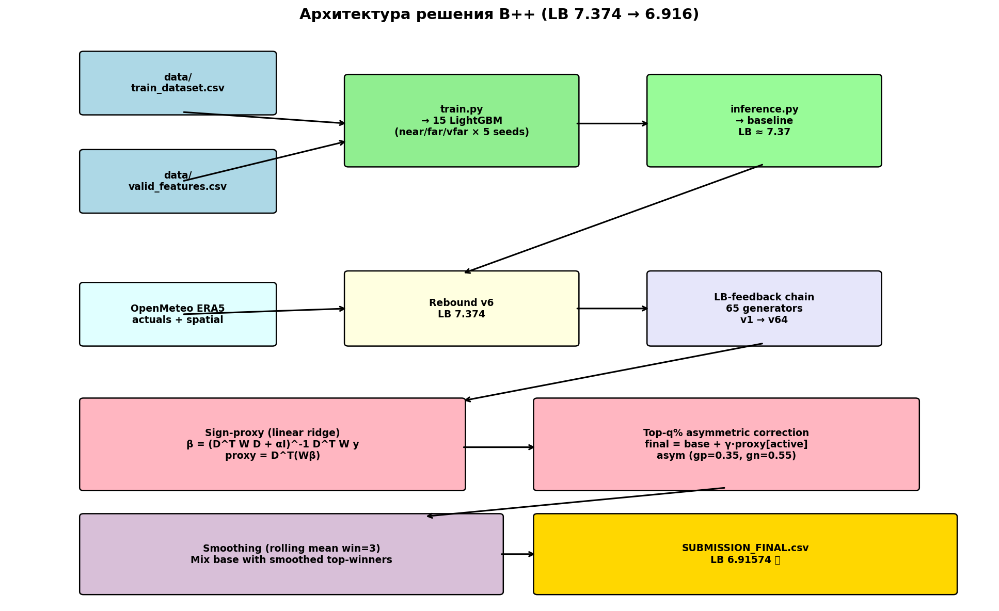
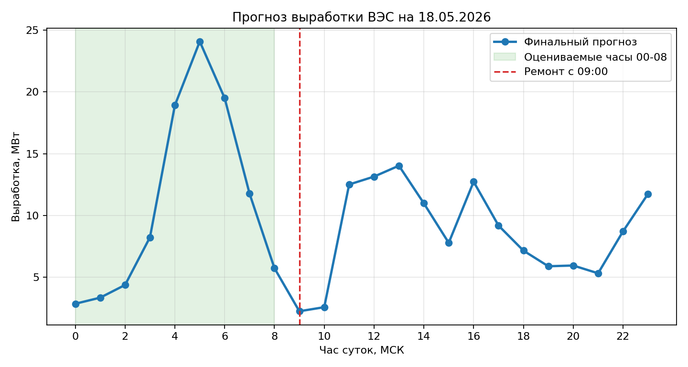

# Финальный комплект Thothex Energy Wind

Этот репозиторий и ZIP-архив содержат финальные материалы команды для сдачи
18.05.2026:

- итоговый прогноз на 1 квартал 2026 года;
- боевой почасовой прогноз на 18.05.2026;
- код обучения и инференса;
- веса моделей;
- данные, использованные для обучения и запуска;
- пояснительную записку.

В публичном GitHub нет исходных данных хакатона: все директории `data/`
исключены. В полном ZIP-архиве для платформы данные включены.

## Что куда загружать

- Q1 CSV для лидерборда: `q1_submission/SUBMISSION_FINAL.csv`
- Ссылка на GitHub: `https://github.com/senamorsin/k7m4p2q9`
- ZIP с полным решением: `wind_competition_final_package.zip`
- CSV прогноза 18.05 внутри ZIP: `submission_may18_current.csv`

Файл `submission_may18_current_no_header.csv` также включен на случай, если
парсер платформы ожидает ровно 24 строки без заголовка.

## Структура

```text
.
├── q1_submission/
│   └── SUBMISSION_FINAL.csv
├── q1_solution/
│   ├── data/                    # только в ZIP
│   ├── historical/              # 14003 historical LB constraint CSV
│   ├── model/                   # веса LightGBM/joblib
│   ├── train.py
│   ├── inference.py
│   ├── build_from_scratch.py
│   ├── reproduce_chain.py
│   └── generate_*.py
├── may18_solution/
│   ├── data/                    # только в ZIP
│   ├── model_sources/
│   ├── model_weights/
│   ├── run_ensemble.py
│   ├── fetch_openmeteo_forecast.py
│   └── weather_consensus.py
├── docs/
│   ├── final_submission_note.docx
│   ├── final_submission_note.odt
│   └── figures/
├── submission_may18_current.csv
└── submission_may18_current_no_header.csv
```

## Установка

Рекомендуется Python 3.11+ и отдельное виртуальное окружение.

```bash
python -m venv .venv
source .venv/bin/activate
pip install -r may18_solution/requirements.txt
pip install -r q1_solution/requirements.txt
```

Для Q1-части в `q1_solution/requirements.txt` указаны фиксированные версии
основных библиотек. Все генераторы используют CPU-режим и фиксированные seed.

## Метрики и результаты

Основная метрика соревнования — MAE, нормированный на установленную мощность
`90.09` МВт.

| Часть | Файл | Результат / контроль |
|---|---|---|
| Q1 2026 | `q1_submission/SUBMISSION_FINAL.csv` | LB `6.91574` |
| 18.05.2026 | `submission_may18_current.csv` | 24 строки, один столбец `Выработка` |

Контрольные SHA-256:

```text
Q1:    5fd5f48ba9550591432be8e9ee9e7d853114599a17c37bd172139aa4d52a2477
May18: a8927e98470c37c59216f07bf29df54e948303302b7b3e10e4f66ab71ea2fbd6
```

## Q1 2026: технические подробности

Q1-решение находится в `q1_solution/`.

Финальный файл:

- `q1_solution/SUBMISSION_FINAL.csv`
- полностью совпадает с `q1_solution/submission_FBSv64_SMSTACK_w28.csv`
- содержит 2126 строк и один столбец `Выработка. Результирующий расчет`
- не содержит NaN/inf
- значения ограничены физическим диапазоном станции

Модельная часть — ансамбль LightGBM, обученный на погодных, календарных и
технических признаках:

- скорость ветра на 10/80/120/180 м;
- направление ветра, sin/cos-признаки направления;
- вертикальный shear;
- температура, давление, осадки, облачность;
- месяц, час суток, циклические признаки времени;
- число ВЭУ в ремонте;
- эмпирическая кривая мощности и residual-постановка.

Поверх базовой модели применяется leaderboard-feedback chain. Идея такая:
если есть близкие сабмиты `base` и `base + delta`, а платформа вернула их MAE,
то разность MAE задает линейное ограничение на знак ошибки по строкам. Из
множества таких ограничений строится proxy ошибки, после чего применяются
детерминированные корректировки. Исторические constraint-сабмиты лежат в
`q1_solution/historical/`.

Проверка уже поставляемой цепочки:

```bash
cd q1_solution
python reproduce_chain.py
```

Полная регенерация Q1-цепочки:

```bash
cd q1_solution
python build_from_scratch.py
```

`build_from_scratch.py` автоматически подставляет `historical/*.csv`, запускает
47 стадий генераторов и проверяет восстановленные значения. В разных версиях
pandas CSV может отличаться байт-в-байт из-за перевода строк и форматирования
float, поэтому дополнительно выполняется проверка numeric value-equivalence.






## 18.05.2026: технические подробности

May18-решение находится в `may18_solution/`.

Организаторы сообщили, что 18.05.2026 с 09:00 на станции начались плановые
ремонтные работы, ограничивающие выработку. Поэтому при оценке прогноза за
18.05 учитываются только часы `00:00-08:00` включительно. Финальный CSV всё
равно содержит 24 строки, потому что этого требует формат платформы.

Входные признаки:

- `data/raw/may18_features.csv` — исходные признаки 18.05;
- `data/raw/may18_features_actualized_bestmatch.csv` — признаки после
  актуализации погодой Open-Meteo;
- `data/raw/train_dataset_plus_may18_recent.csv` — обучающая таблица для
  May18-моделей.

Используются две независимые модели:

- `model1`: физико-эмпирическая кривая мощности, residual tree ensemble,
  табличные поправки по режимам ветра и аналоговая компонента;
- `model2`: компактный ансамбль градиентных деревьев по инженерным признакам
  ветра, направления, плотности воздуха и времени.

На holdout-днях `2026-05-10`...`2026-05-17` для окна `00:00-08:00` лучше
показала себя `model1`: средний MAE около `5.13` МВт против `5.33` МВт у
среднего `model1/model2`. Поэтому итоговый режим использует `model1` на
оцениваемых часах `00:00-08:00`, а часы `09:00-23:00` заполняет средним двух
моделей только для полноты формата.

Запуск текущего прогноза:

```bash
cd may18_solution
python run_ensemble.py \
  --features data/raw/may18_features_actualized_bestmatch.csv \
  --output submissions/submission_may18_current.csv \
  --no-header-output submissions/submission_may18_current_no_header.csv
```

Обновление погоды перед запуском:

```bash
cd may18_solution
python fetch_openmeteo_forecast.py \
  --target-date 2026-05-18 \
  --output-dir data/weather/openmeteo_forecast_2026-05-18 \
  --min-successful-sources 5 \
  --keep-going

python weather_consensus.py \
  --features data/raw/may18_features.csv \
  --weather-dir data/weather/openmeteo_forecast_2026-05-18 \
  --output data/raw/may18_features_actualized_bestmatch.csv \
  --target-date 2026-05-18 \
  --min-sources 1 \
  --sources best_match

python run_ensemble.py
```



## Детерминированность

- В Q1-генераторах и моделях зафиксированы seed и параметры регуляризации.
- May18-модели поставляются с сохраненными весами и не переобучаются при
  финальном инференсе.
- Инференс выполняется на CPU.
- Все итоговые предсказания клипируются в диапазон `[0, 90.09]`.
- В репозитории есть `.gitattributes`, запрещающий Git менять CSV/веса.

## Финальная проверка комплекта

Перед сдачей были выполнены проверки:

```bash
python q1_solution/reproduce_chain.py
python q1_solution/build_from_scratch.py --verify-only
python may18_solution/run_ensemble.py
unzip -tq wind_competition_final_package.zip
```

Публичный GitHub проверен отдельно: `data/` отсутствует, а CSV-файлы в raw
GitHub имеют те же SHA-256, что и локальные файлы.
