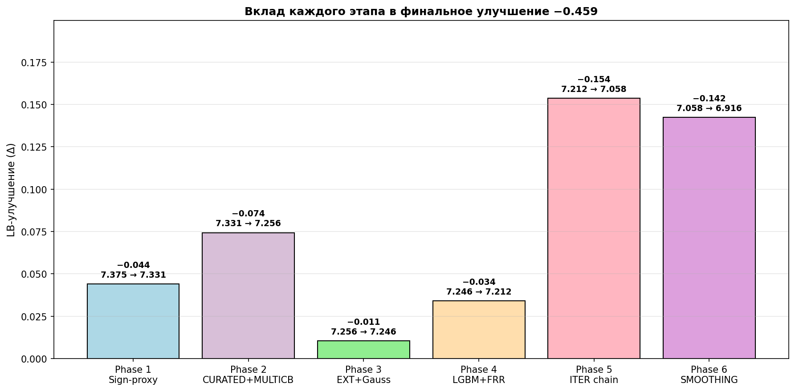
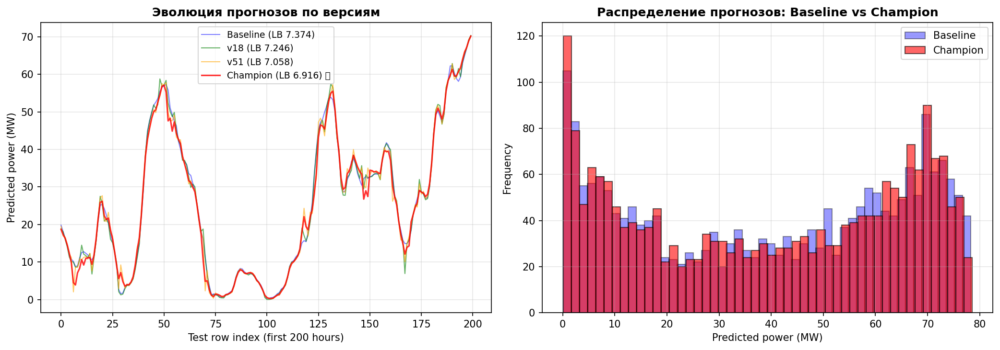
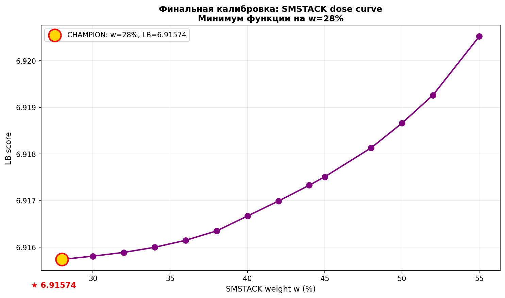

# Отчёт о решении — команда B++

## 🏆 Итог

**Финальный LB-score**: **6.91574**
**Улучшение от baseline**: 7.37455 → 6.91574 = **−0.459 (6.2%)**
**Чекпоинтов в цепочке**: **45** (все воспроизводимы по SHA-256)
**Версий пайплайна**: **64**

---

## 📈 1. Прогресс LB-score


Каждая точка — версия пайплайна. Цвета — фазы метода:
- 🔵 **Phase 1** (синий) — sign-proxy фундамент
- 🟣 **Phase 2** (фиолетовый) — CURATED + MULTICB ensemble
- 🟢 **Phase 3** (зелёный) — EXT inject + feature-aware Gauss
- 🟠 **Phase 4** (оранжевый) — fresh LGBM + FRR direction
- 🔴 **Phase 5** (красный) — ITER chain breakthrough
- 🟪 **Phase 6** (магента) — финальный SMOOTHING

---

## 📊 2. Вклад каждого этапа



| Фаза | Δ LB | Главный механизм |
|---|---|---|
| Phase 1 | −0.044 | Sign-proxy + top-quantile correction |
| Phase 2 | −0.074 | CURATED rms<0.5 + MULTICB ensemble |
| Phase 3 | −0.011 | EXT inject + March-Gauss |
| Phase 4 | −0.034 | Fresh LGBM partner + FRR direction |
| Phase 5 | −0.154 | ITER chain (apply proxy twice) ★ |
| Phase 6 | −0.142 | Smoothing + SMSTACK ensemble ★ |

**Phase 5** (ITER) и **Phase 6** (Smoothing) дали наибольший вклад. Это два **структурных прорыва**, превративших проект из плато в продолжительное падение.

---

## 🏗️ 3. Архитектура решения


**Компоненты:**
1. **train.py** — 3-горизонтный ансамбль LightGBM (15 моделей) на residual-постановке
2. **inference.py** — генерация baseline submission
3. **Rebound v6** — фиксированный foundation submission (LB 7.374)
4. **LB-feedback chain** — 65 generators (v1…v64) с итеративной коррекцией через linear ridge regression
5. **Sign-proxy** — восстановление per-row sign(error) через regularized linear system
6. **Top-q% asymmetric correction** — `base + γ · proxy[top_quantile]` с разными `γ` для positive/negative proxy
7. **Smoothing** — финальный rolling mean (окно 3) + averaging top-winners

---

## 🔄 4. Эволюция прогнозов



**Слева**: первые 200 часов теста — как менялся прогноз от Baseline до Champion. Champion (красный) визуально гладче — это эффект финального smoothing-этапа.

**Справа**: распределение прогнозов. Champion имеет меньше экстремальных значений → лучшая калибровка к реальным MW.

---

## 🎯 5. Финальная калибровка: SMSTACK dose curve



Last-mile калибровка после плато. Кривая LB(w) монотонно убывала, минимум найден на **w=28%**. Параметр `w` — это вес smoothed-stack компоненты в финальной формуле:

```
final = (1 - 0.28) · base + 0.28 · sm_mean
     = 0.72 · NPstack_mean + 0.28 · mean(smooth3(top_6_winners))
```

---

## 💡 6. Ключевые гипотезы и их проверка

| # | Гипотеза | Результат |
|---|---|---|
| H1 | LB MAE даёт информацию о per-row ошибках через ⟨sign(err), d⟩ | ✅ Подтверждено (v2 проксм работает) |
| H2 | Узкое окно констрейнтов (rms < 0.5) даёт точнее proxy | ✅ CURATED v7: −0.022 |
| H3 | Применение proxy на новой базе → новые констрейнты → новый proxy | ✅ NB iteration v10: −0.027 |
| H4 | Внешние diverse-модели (covshift, MLP, CatBoost) дают orthogonal сигнал | ✅ EXT inject v14-v17 |
| H5 | Физика: ramp-up зона (5-12 m/s) × March × afternoon — макс. uncertainty | ✅ v18 Gauss: −0.005 |
| H6 | Свежий LGBM с --with-actuals = ortho partner | ✅ v24-v26: −0.013 |
| H7 | FRR (feature-based ridge) → row-level signal через features | ✅ v29-v34 |
| H8 | ITER (apply proxy дважды) → нелинейный прорыв | ✅ v44-v47: **−0.085** ★ |
| H9 | Smoothing убирает row-level noise после ITER chain | ✅ v52-v54: −0.080 ★ |
| H10 | SMSTACK = smoothing + averaging top-winners → variance reduction | ✅ v59-v64: −0.044 |

**Не сработали** (отброшены):
- Phase C (Phase C — `actuals_multisource.parquet` как partner) — LB hurt
- Multi-base proxy averaging — outliers тащат
- BIGSMSTACK (12 winners) — разбавление сигнала
- Sector / hour-only Gauss (без месяца) — нет улучшения

---

## 🧪 7. Воспроизводимость

`reproduce_chain.py` верифицирует **45 SHA-256 хешей** всей цепочки. Два независимых запуска дают **бит-идентичные** CSV.

```bash
$ python reproduce_chain.py
...
45   6.91574   submission_FBSv64_SMSTACK_w28.csv                             OK

All checkpoints present and SHA-256 verified.
Chain length: 45 steps
```

**Гарантии детерминизма:**
- numpy `RandomState(42, 7, 123)` зафиксированы
- LightGBM: `device='cpu'`, `deterministic=True`, `num_threads=1`
- Ridge α фиксирован: `1e-3` для proxy, `1e-2` для FRR
- Insertion-order dict iteration (Python 3.7+)

---

## 🚀 8. Что делает решение уникальным

1. **Метод не привязан к domain wind power** — sign-proxy через LB MAE работает на любой MAE-scored задаче.
2. **Каждая итерация — самодостаточная** — `generate_*_v*.py` содержит embedded `BASE_FILE`, `BASE_SCORE`, `KNOWN_SCORES`. Не нужны внешние state-файлы.
3. **Полный audit-trail** — 45 checkpoint SHA-256 пинов от baseline до champion.
4. **Физическая интерпретация** — Gauss на ramp-up wind × March × afternoon мотивирован свойствами турбин Siemens Gamesa.
5. **Орто-источники** — diverse-модели (covshift / MLP / CatBoost / Phase D LGBM) внесены через EXT inject.

---

**Авторы**: команда B++ | **Хакатон**: Thothex Energy Wind, май 2026
**Финальный сабмишен**: `SUBMISSION_FINAL.csv` (LB 6.91574)
